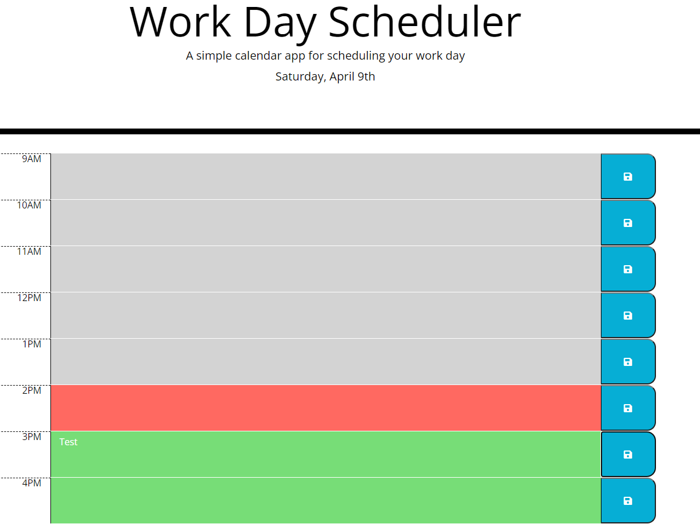

# Work Day Scheduler

## Purpose
To provide employees with a method of tracking their schedule for the day

## Built With
* HTML
* CSS
* JavaScript
* JQuery
* BootStrap

## Website
* https://ppepin34.github.io/work-day-scheduler/

## Screenshot

## Contribution

Built by Phil Pepin with start code provided by UR Boot Camp